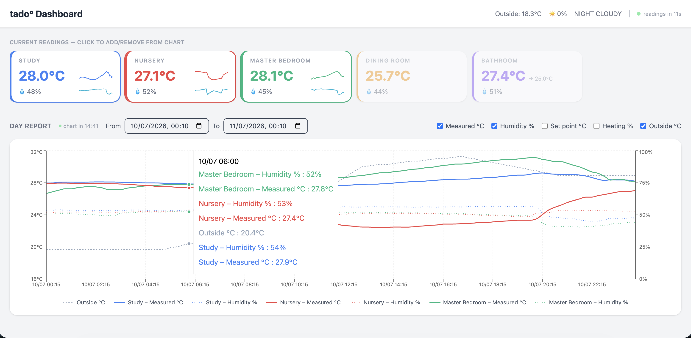

# tado-dashboard

Better dashboards for your tado° smart thermostat data.



## Architecture

| Layer | Stack |
|---|---|
| Backend | Clojure, Ring, reitit, clj-http |
| Frontend | React 18, TypeScript, Vite, Recharts, Tailwind CSS |

The Clojure backend acts as an authenticated proxy to the tado API v2, exposing
a clean REST API for the frontend.

### Weather data

Outside temperature and humidity are sourced from **[Open-Meteo](https://open-meteo.com)**
rather than from the tado weather endpoint. tado's weather data uses a coarse
forecast model with readings only a few times per day, which produces noticeable
discrepancies from actual conditions. Open-Meteo provides:

- **Current conditions** (banner) — polled every 30 seconds alongside tado zone data
- **Historical data** (chart) — hourly resolution for any date range, using the
  home's geolocation coordinates fetched from the tado API

Open-Meteo is free with no account or API key required. The home's coordinates
are read from tado's `/homes/:id` endpoint, so weather data always reflects the
location of the thermostats rather than the user's device.

## API limits

### tado

tado enforces a **per-day request limit** on their REST API
([source](https://support.tado.com/en/articles/12165739-limitation-for-rest-api-usage)):

| Account type | Daily limit |
|---|---|
| Standard | 100 requests / day |
| Auto-Assist / AI Assist subscriber | 20,000 requests / day |

> **⚠️ Standard accounts will hit 100 requests in under 10 minutes** when the
> dashboard is open, because zone states are refreshed every 30 seconds across
> all rooms. An Auto-Assist subscription is effectively required for continuous
> use.

The dashboard displays the remaining request count in the header and updates it
on every refresh cycle. A toggle switch lets you pause auto-refresh to conserve
requests — useful when you want to leave the page open without burning through
your daily allowance. Refreshing resumes immediately when you toggle it back on.

You can also check the raw limit by inspecting the `ratelimit` response header
on any tado API call, e.g. `"perday";r=123` means 123 requests left;
`"perday";r=0;t=60` means exhausted, refilling in 60 seconds.

### Open-Meteo

Open-Meteo's free tier has generous limits well above what this app will use:

| Limit | Free tier |
|---|---|
| Per minute | 600 calls |
| Per hour | 5,000 calls |
| Per day | 10,000 calls |
| Per month | 300,000 calls |

Note: the free tier does not permit commercial use.

## Setup

### Option A — combined server (recommended)

```sh
make start   # builds frontend, starts server at http://localhost:3000
```

On first run, open `http://localhost:3000` in your browser. You'll be prompted to
connect your tado° account — click **Connect tado°**, approve in the new tab, and
the dashboard loads automatically. The refresh token is saved to
`backend/.tado-token.edn` so subsequent starts need no browser interaction.

### Option B — development (hot-reload frontend)

Run in two separate terminals:

```sh
make backend    # API server on http://localhost:3000
make frontend   # Vite dev server on http://localhost:5173
```

### Option C — standalone uberjar

```sh
make jar
java -Djavax.net.ssl.trustStoreType=KeychainStore \
     -jar backend/target/tado-dashboard-0.1.0.jar
```

Run `make help` to see all available targets.

## API Routes

| Method | Path | Description |
|---|---|---|
| GET | `/api/me` | Current user + home IDs |
| GET | `/api/homes/:id/zones` | List zones (rooms) |
| GET | `/api/homes/:id/zones/:zone-id/state` | Current temperature, humidity, heating |
| GET | `/api/homes/:id/zones/:zone-id/day-report?date=YYYY-MM-DD` | Historical day data |
| GET | `/api/homes/:id/weather` | Current outside temperature & humidity (Open-Meteo) |
| GET | `/api/homes/:id/outside-weather?from=YYYY-MM-DD&to=YYYY-MM-DD` | Hourly historical outside temperature & humidity (Open-Meteo) |
| GET | `/api/homes/:id/state` | Home presence (HOME/AWAY) |

## Window notifications

The backend runs a background monitor that compares each room's current temperature
against the outside temperature and sends a push notification when they cross:

| Event | Notification |
|---|---|
| Outside exceeds inside | 🌡️ Close windows — [Room] |
| Inside exceeds outside | 🪟 Open windows — [Room] |

Notifications are delivered via **[ntfy.sh](https://ntfy.sh)** — a free push
notification service with iOS and Android apps.

### Setup

1. Install the **ntfy** app on your phone
2. Start the server — on first run it generates a private random topic and prints it:
   ```
   Temperature monitor enabled — subscribe to ntfy.sh topic: a3f8c2d1-...
   ```
   The topic is saved to `.tado-ntfy.edn` and reused on subsequent restarts.
3. In the ntfy app tap **+** and enter the topic name shown in the log

That's all — no accounts, API keys, or environment variables required.

### Tuning

Edit `:monitor` in `backend/resources/config.edn`:

```edn
:monitor {:enabled       true
          :interval-secs 300   ; how often to poll (default 5 minutes)
          :hysteresis-c  0.5}  ; dead-band to prevent flapping (default 0.5°C)
```

Set `:enabled false` to disable the monitor entirely.
